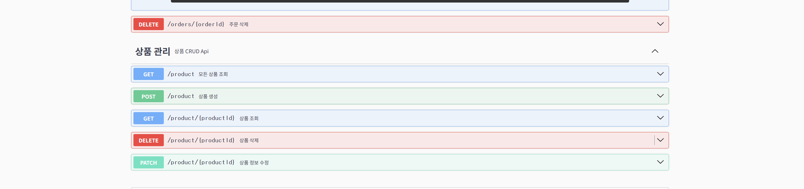
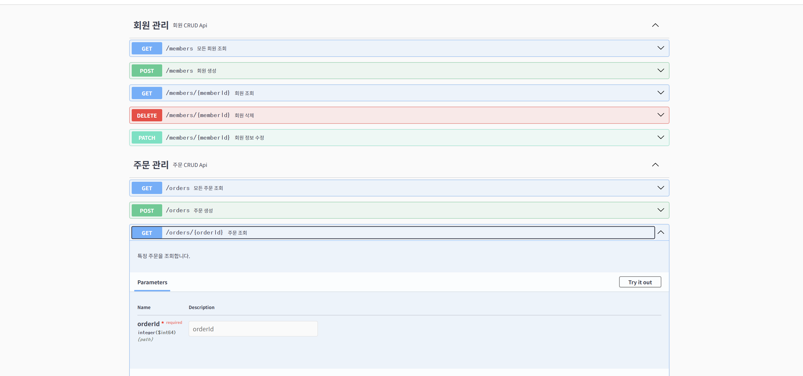
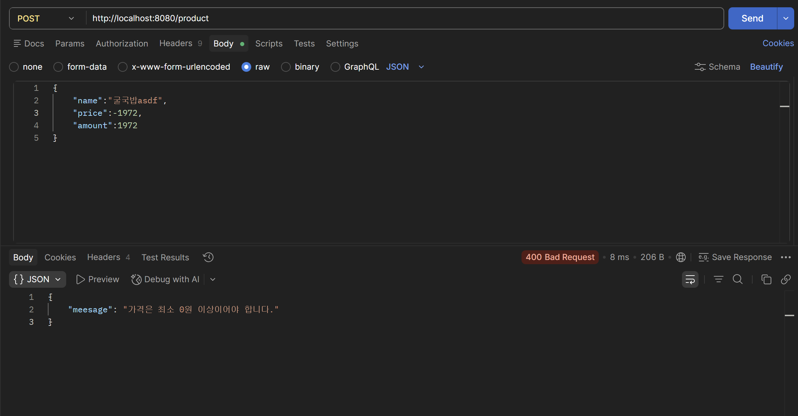

## 유효성 검사
주어진 입력값이 프로그래머가 생각한(설정한) 입력값의 형식에 부합하는지 여부를 검사하는 것이다.  
이는 클라이언트가 형식을 벗어나는 입력값을 주었을때, 누가 문제인지 알게 해줄 수 있으므로 유용하다.
(4XX에러로 클라이언트 측 문제라는 걸 알려주는 것)

## 예외처리
특정 오류가 발생되었을 때, 정보를 반환하기 위해 사용한다.  
사용하는 방법은 다음과 같은 세가지 정도가 있다.  
- Global Exception Handler
- 커스텀 예외처리
- 에러 메시지 클래스

Global Exception Handler는 전체적인 코드 내에서 오류가 발생할때, 기본적인 에러 정보를 봔환하기 위한 도구이다.  
APO(관점지향 프로그래밍)으로 모든 문제를 한곳에 집약시킨다.  

커스텀 예외처리는 위에서 사용된 것 중 특별한 경우에만 프로그래머가 직접적으로 메세지를 집어 넣는 것이다.  

애러 메시지 클래스는 자주 반복되는 에러메시지 특성상 만들어지며, 상수값의 문자열로 이루어져 있다.  
코드 내에서 해당 클래스 내에 있는 메시지를 호출하여 사용한다.

## API 문서화
api 시용설명서로 클라이언트(프론트엔드)와 원활한 소통이 가능하게 한다.
이는 swagger관련 의존성을 추가해줌으로써 쉽고 빠르게 만들 수 있다.

